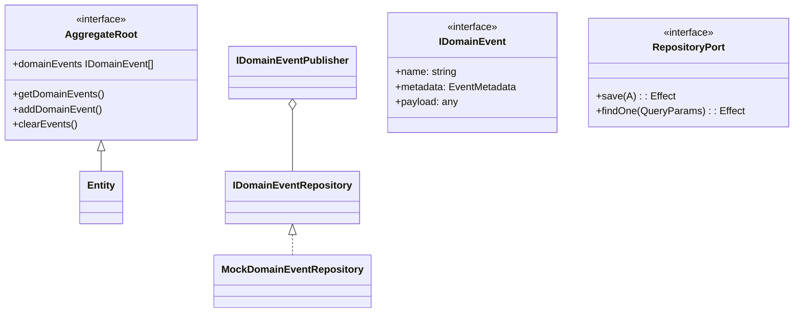

# Domain Model with Effect

This document describes the domain model implementation using Effect for functional error handling and dependency management.

## Core Concepts

### 1. Aggregate Root

The root entity that maintains consistency boundaries in the domain.

#### Key Types:
- `AggregateRoot<Props>`: Extends Entity with domain events capability
- `WithAggregateMetaInput<OriginInput>`: Input type for aggregate creation
- `AggregatePropsParser<A, I>`: Parser for aggregate properties
- `AggregateRootTrait<A, N, P>`: Trait interface for aggregate operations
- `IAggGenericTrait`: Generic aggregate operations implementation

#### Key Operations:
- Managing domain events (add/clear/get)
- Command pattern implementation via `asCommand`
- Creation via `createAggregateRootTrait`

### 2. Domain Events

Events representing significant state changes in the domain.

#### Key Types:
- `IDomainEvent<P>`: Interface for domain events
- `IDomainEventTrait`: Factory for creating domain events
- `IDomainEventRepository`: Persistence interface for events
- `IDomainEventPublisher`: Publishing interface for events

#### Key Operations:
- Event creation with metadata (correlationId, causationId etc)
- Event persistence (save, mark as handled)
- Event publishing (single or multiple)

### 3. Repository Pattern

Generic persistence interface for aggregates.

#### Key Types:
- `RepositoryPort<A, QueryParams>`: Main repository interface
- `FindManyPaginatedParams`: Pagination parameters
- `DataWithPaginationMeta<T>`: Paginated response type

#### Key Operations:
- CRUD operations (save, find, delete)
- Paginated queries
- Transaction support

### 4. Mock Implementations

Test implementations for domain event handling.

#### Key Components:
- `MockDomainEventRepository`: In-memory event store
- `MockDomainEventRepositoryLayer`: Effect Layer for testing

## Implementation Details

### Aggregate Root Implementation

```typescript
// Example aggregate creation
const UserAggregateTrait = AggGenericTrait.createAggregateRootTrait(
  UserPropsParser,
  'User',
  { autoGenId: true }
);

// Example command
const changeEmail = AggGenericTrait.asCommand<UserAggregate, ChangeEmailInput>(
  (input, props, aggregate, correlationId) => 
    Effect.succeed({
      props: { ...props, email: input.newEmail },
      domainEvents: [
        DomainEventTrait.create({
          name: 'UserEmailChanged',
          payload: { userId: aggregate.id, newEmail: input.newEmail },
          correlationId
        })
      ]
    })
);
```

### Domain Event Flow

1. **Creation**: Events are created via `DomainEventTrait.create()`
2. **Persistence**: Saved via `IDomainEventRepository.save()`
3. **Publication**: Published via `IDomainEventPublisher.publish()`
4. **Processing**: Marked as handled via `markAsHandled()`

### Testing Setup

```typescript
// In tests
const testLayer = MockDomainEventRepositoryLayer.pipe(
  // Add other test dependencies
);

Effect.runPromise(
  Effect.provide(
    myDomainService,
    testLayer
  )
);
```

## Type Hierarchy



## Best Practices

1. Always include correlation IDs in commands and events
2. Use the `asCommand` pattern for state changes
3. Keep aggregates small and focused
4. Prefer explicit event publishing over implicit
5. Use mock implementations for isolated testing
